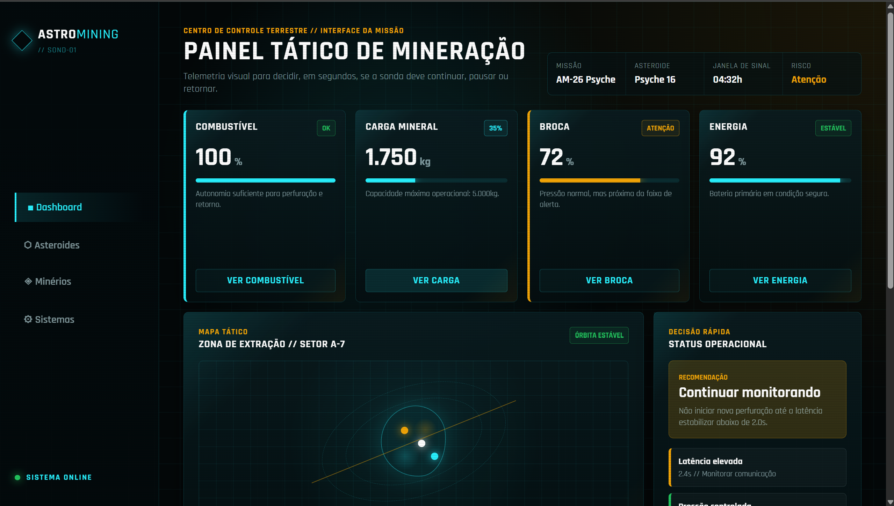
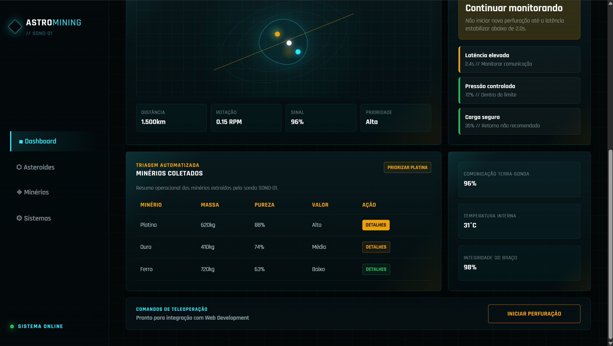
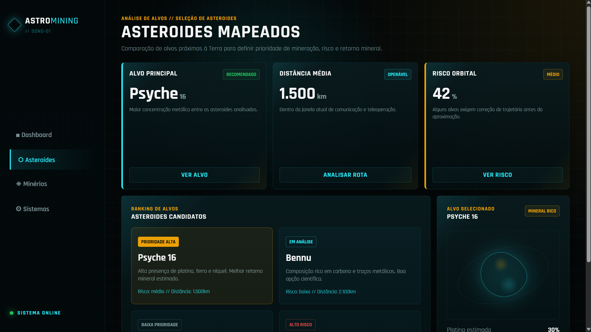
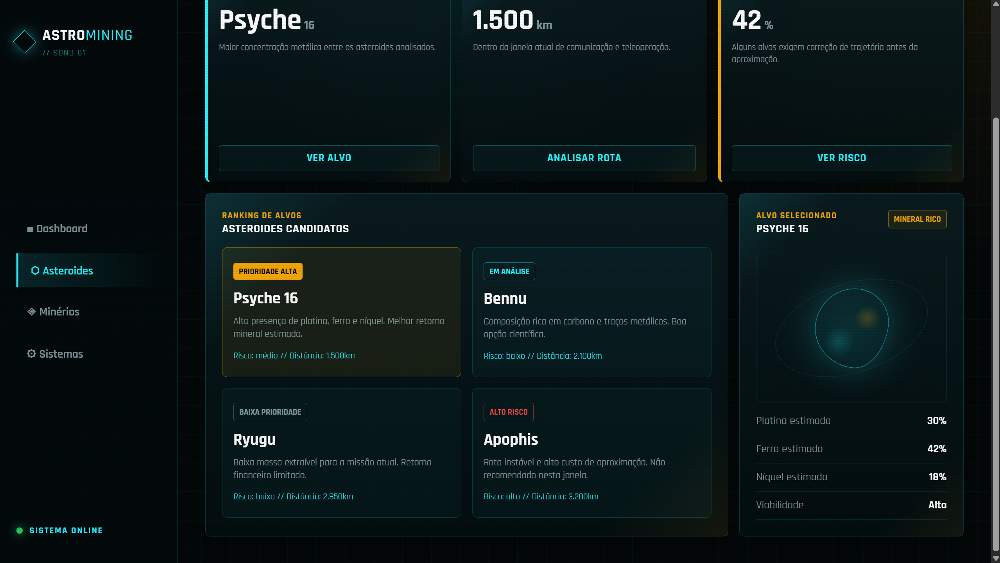
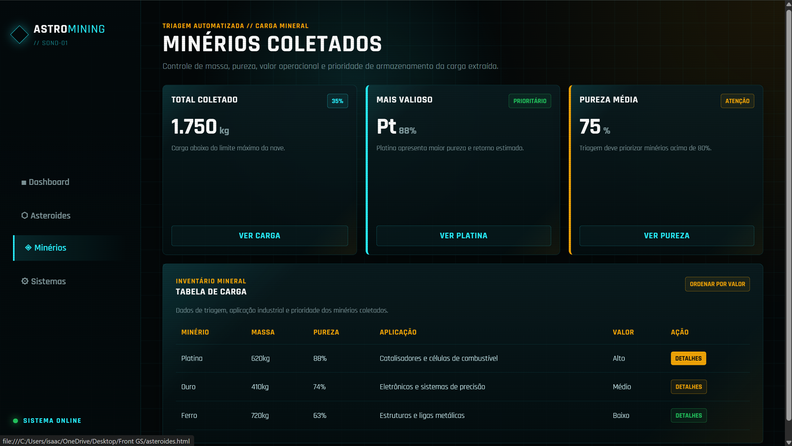
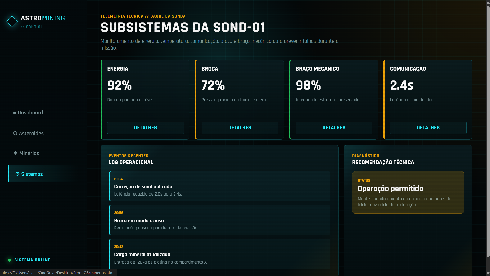

# Moodboard & Direção Visual — AstroMining OS

Documento de direção visual da interface da missão. Reúne o conceito, a análise crítica
das referências e a justificativa de cada decisão estética em função do **usuário**
(o operador da missão) e da **tarefa crítica** (decidir, em segundos, o próximo passo da
sonda).

> **Nota:** as imagens de referência e os screenshots da interface devem ser adicionados
> a esta mesma pasta (`assets/`) e referenciados abaixo. Todo `` inserido deve ter
> atributo `alt` descritivo.

---

## 1. Conceito central

> **"Um cockpit de missão que parece do espaço, mas se lê como um painel de controle."**

A interface precisa equilibrar duas forças que normalmente competem entre si:

1. **Identidade espacial / futurista** — o produto é um sistema de mineração de
   asteroides; precisa transmitir esse contexto imediatamente.
2. **Experiência de uso sob pressão** — o operador toma decisões críticas em segundos;
   nada na tela pode atrapalhar a leitura do dado.

A direção final é o **meio-termo deliberado** entre essas duas forças.

---

## 2. Processo: da primeira ideia à versão final (análise crítica)

### O que foi testado primeiro
A primeira exploração foi **mais "espacial"**: muito mais elementos visuais, efeitos e
ornamentação de ficção científica.

**O que aprendemos descartando:** ficou **bonito, porém poluído**. O excesso de estímulo
visual competia com a informação e tornava o sistema **pouco intuitivo** — o operador
teria dificuldade de localizar rapidamente o dado que importa. Para uma interface de
missão, isso é um defeito grave: *ilegível é igual a invisível*.

### O que foi mantido e por quê
A segunda versão **reduziu o ruído** e adotou uma linha **clean**:

- Manteve a **ambientação espacial** (fundo escuro, HUD, mapa orbital) como *pano de
  fundo*, não como protagonista.
- Promoveu o **dado** a elemento principal: números grandes, estados em cores claras,
  agrupamento por prioridade.
- Resultado: o clima futurista permanece, mas a leitura ficou direta e intuitiva.

**Conclusão da análise:** a estética só se justifica quando serve à tarefa. Tudo que
dificultava a decisão do operador foi removido; tudo que reforça contexto sem competir
com o dado foi mantido.

---

## 3. Decisões de design e justificativa

### 3.1 Paleta de cores
| Cor | Uso | Por quê |
|-----|-----|---------|
| Fundo quase-preto (`#030708`) | Base de todas as telas | Remete ao espaço; reduz fadiga visual em monitoramento longo; dá contraste máximo ao dado. |
| Ciano (`#00f2fe`) | Informação, estrutura, navegação | Cor "fria" tecnológica; alta legibilidade sobre o escuro; identifica o que é leitura normal. |
| Dourado (`#f5a400`) | Atenção, prioridade, ação | Contrasta com o ciano e "salta" aos olhos; sinaliza onde o operador deve olhar primeiro. |
| Verde / Vermelho | Estados OK / crítico | Convenção universal de status, reduz carga cognitiva. |

O par **ciano (normal) + dourado (atenção)** permite comunicar o estado de um item
**sem depender de texto** — essencial para decisão em segundos.

### 3.2 Tipografia
- **Rajdhani** (Google Fonts): fonte condensada de tom técnico/militar. Reforça a
  identidade futurista e mantém excelente legibilidade em números, rótulos em caixa alta e
  tabelas — onde o operador mais lê.

### 3.3 Elementos de HUD (ambientação)
- **Scanlines**, **grid de fundo** e **mapa orbital animado** criam o clima de cockpit.
- Usados com **baixa opacidade e moderação**, para ambientar sem roubar atenção do dado.

### 3.4 Hierarquia da informação
- **KPIs no topo** (combustível, carga, broca, energia): o estado vital da sonda primeiro.
- **Painel de Decisão Rápida** com recomendação + alertas agrupados: o "o que fazer agora".
- **Detalhes** (mapa, tabela de minérios, subsistemas) abaixo, para aprofundamento.

---

## 4. Referências visuais

A equipe **não partiu de uma referência concreta única**, mas de uma intenção: transmitir
um **visual espacial e moderno**. As famílias de referência que informaram a estética:

- **HUDs de ficção científica** (cockpits de filmes/jogos): clima de cockpit, scanlines,
  cantos com acento — *pegamos a ambientação, descartamos o excesso ornamental*.
- **Dashboards de telemetria / centros de controle** (estilo NASA/missão): hierarquia de
  KPIs, medidores e estados de cor — *pegamos a organização orientada a decisão*.
- **Design systems escuros modernos**: uso de tokens, cards e espaçamento consistente —
  *pegamos a clareza e a consistência*.

> **A adicionar:** prints de inspiração + screenshots da interface final, salvos nesta
> pasta, para compor o moodboard visual.

---

## 5. Componentes globais (presentes em todas as telas)

Estes elementos se repetem em todas as páginas para dar **consistência** e uma sensação
de "sistema único". O operador aprende uma vez e reconhece em qualquer tela.

### Barra lateral (`<aside class="sidebar">`)
A coluna fixa à esquerda é o "casco" do sistema. Reúne identidade, navegação e status num
lugar previsível, sempre visível enquanto o operador rola a tela.

- **Marca (`brand`)** — losango com brilho + "ASTRO**MINING** // SOND-01". Estabelece a
  identidade e lembra qual sonda está sendo operada. O losango inclinado remete a um
  marcador de radar/HUD.
- **Navegação (`nav`)** — links para Dashboard, Asteroides, Minérios e Sistemas, cada um
  com um ícone geométrico. A página atual recebe a classe `active` (texto ciano + barra
  lateral acesa + `aria-current="page"`), então o operador **sempre sabe onde está**.
- **Status "SISTEMA ONLINE" (`sidebar-status`)** — ponto verde pulsante + texto. É um sinal
  de tranquilidade: enquanto está verde, a comunicação com a sonda está ativa. Usa
  `role="status"` para ser anunciado por leitores de tela.

### Ambientação de fundo
- **Scanlines (`.scanlines`)** — finíssimas linhas horizontais sobre toda a tela, em baixa
  opacidade, simulando um monitor de cockpit antigo. Puramente decorativo
  (`aria-hidden="true"`), não atrapalha a leitura.
- **Grid + brilhos radiais no `body`** — uma grade técnica sutil e dois halos (ciano e
  dourado) dão profundidade espacial sem virar ruído.

### Cabeçalho de página (`header` / `eyebrow` + `h1` + `subtitle`)
Todo topo de tela segue o mesmo padrão de leitura em 3 níveis:
1. **Eyebrow** (linha dourada em caixa alta) — o "contexto/categoria" da tela.
2. **H1** (título grande branco) — o "onde estou" imediato.
3. **Subtitle** (texto suave) — uma frase que explica a utilidade da tela para a missão.

### Cards, selos e botões (sistema de componentes)
- **`metric-card`** — cartão de indicador reutilizado em várias telas. Borda lateral
  colorida indica o estado (ciano = ok, dourado = atenção).
- **`state-badge` / `status-pill`** — selos compactos de status (OK, Atenção, Alto…). Cor =
  significado, para leitura instantânea.
- **`meter`** — barra de progresso fina com brilho, mostra proporção (ex.: combustível)
  de forma visual. Tem `role="progressbar"` com valores ARIA para acessibilidade.
- **`card-action` / `btn-command`** — botões. Os de ação secundária são discretos (contorno
  ciano); o de comando principal ("Iniciar Perfuração") é dourado e maior, porque é a ação
  mais importante e perigosa da missão.
- **Foco visível** — todos os elementos navegáveis ganham um contorno tracejado dourado ao
  receber foco por teclado.

---

## 6. Anatomia de cada tela (elemento por elemento)

### 6.1 Dashboard (`index.html`)
A tela-mãe: responde "como está a sonda **agora** e o que faço a seguir?".

- **Faixa de missão (`mission-strip`)** — quatro blocos no topo: Missão (AM-26 Psyche),
  Asteroide (Psyche 16), Janela de Sinal (04:32h) e Risco (Atenção, em dourado). É o
  "cabeçalho de contexto" — quem, onde, por quanto tempo e o nível de risco geral.
- **KPIs da sonda (`kpi-grid`)** — quatro `metric-card` com os sinais vitais:
  - **Combustível 100%** — borda ciano (seguro); barra cheia. Autonomia para perfurar e voltar.
  - **Carga Mineral 1.750kg (35%)** — quanto já foi coletado vs. capacidade máxima.
  - **Broca 72%** — borda **dourada** e barra dourada: está normal, mas perto do alerta.
    É o card que mais "chama" visualmente, exatamente o que precisa de atenção.
  - **Energia 92%** — bateria primária estável.
  - *Por quê no topo:* são os dados que decidem se a missão continua. Vêm primeiro.

- **Mapa Tático (`tactical-map`)** — representação visual da zona de extração: asteroide
  girando (animação lenta), órbitas tracejadas, eixo de varredura e **pinos minerais**
  clicáveis (ouro, ferro, platina). Dá noção espacial de *onde* estão os recursos. Tem
  `role="img"` com descrição para quem não enxerga.
  - Abaixo dele, quatro dados de apoio: Distância, Rotação, Sinal e Prioridade.
- **Decisão Rápida (`decision-panel`)** — o coração da tela:
  - **Recomendação** em destaque dourado ("Continuar monitorando") — a orientação direta.
  - **Lista de alertas (`alert-list`)** — cada alerta com borda colorida (dourado =
    atenção, verde = ok): Latência elevada, Pressão controlada, Carga segura. O operador
    lê os três e entende a situação em 2 segundos.
- **Minérios Coletados (`minerals-table`)** — tabela com Platina/Ouro/Ferro (massa, pureza,
  valor) e um selo "Priorizar Platina". Resumo do que já foi extraído.
- **Subsistemas (`systems-panel`)** — três mini-blocos (Comunicação, Temperatura, Braço)
  para um check rápido de saúde técnica.
- **Rodapé de comando (`command-footer`)** — encerra a tela com o botão dourado **Iniciar
  Perfuração**, a ação principal. Fica separado e destacado por ser a decisão de maior peso.

### 6.2 Asteroides (`asteroides.html`)
Responde "**qual alvo** vale a pena minerar?".

- **Resumo (`overview-grid`)** — três cards de visão geral: Alvo Principal (Psyche 16,
  recomendado), Distância Média (1.500km, operável) e Risco Orbital (42%, médio — borda
  dourada). Dão o veredito antes do detalhe.

- **Ranking de Alvos (`target-grid`)** — quatro `target-card` comparáveis lado a lado:
  - **Psyche 16** — "Prioridade Alta" (selo dourado) e card **selecionado** (destacado).
  - **Bennu** — "Em Análise".
  - **Ryugu** — "Baixa Prioridade".
  - **Apophis** — "Alto Risco", com borda/selo **vermelho** — o único em cor de perigo, para
    afastar o operador imediatamente.
  - *Por quê cards e não lista:* comparação visual rápida; cada card traz risco e distância
    no rodapé para decidir sem abrir nada.
- **Alvo Selecionado (`target-detail-panel`)** — painel lateral com mini-visual do asteroide
  + `spec-list` (Platina 30%, Ferro 42%, Níquel 18%, Viabilidade Alta). É o "zoom" no
  candidato escolhido.

### 6.3 Minérios (`minerios.html`)
Responde "**o que** já temos na carga e qual o valor?".

- **Resumo (`overview-grid`)** — Total Coletado (1.750kg / 35%), Mais Valioso (Platina 88%,
  prioritário) e Pureza Média (75%, atenção). Os três números que importam para a triagem.
- **Tabela de Carga (`minerals-table`)** — inventário completo: Minério, Massa, Pureza,
  **Aplicação** (para que serve cada metal), Valor e Ação. A coluna de aplicação dá sentido
  à priorização (ex.: platina para catalisadores e células de combustível).
  - Botão "Ordenar por valor" sugere a triagem por retorno.
  - A tabela tem `<caption>` e cabeçalhos com `scope="col"` (acessibilidade) e rola na
    horizontal em telas estreitas, sem quebrar a leitura.

### 6.4 Sistemas (`sistemas.html`)
Responde "a sonda está **saudável** para continuar?".

- **Saúde dos Subsistemas (`system-health-grid`)** — quatro `system-card` com número grande:
  Energia 92% (ok), Broca 72% (atenção), Braço 98% (ok) e Comunicação 2.4s (atenção). A
  borda colorida e o tamanho do número permitem varrer a saúde geral num relance.
- **Log Operacional (`log-list`)** — linha do tempo dos eventos recentes (correção de sinal,
  broca ociosa, carga atualizada), cada um com horário em dourado. Conta o "histórico" da
  missão, útil para entender *como* chegamos ao estado atual.
- **Recomendação Técnica (`decision-callout`)** — bloco de diagnóstico ("Operação
  permitida") que traduz todos os números numa orientação acionável. Fecha o raciocínio da
  tela.

---

## 7. Síntese da lógica visual

Todas as telas seguem o mesmo contrato de leitura, o que torna o sistema previsível:

1. **Contexto primeiro** (eyebrow + título + resumo).
2. **Estado em cor** (verde = ok, dourado = atenção, vermelho = perigo) para decisão em segundos.
3. **Detalhe depois** (tabelas, mapa, listas) para quem precisa aprofundar.
4. **Ação destacada** (botões dourados) sempre que há uma decisão a tomar.

Cada elemento existe para responder a uma pergunta do operador — nada é decorativo sem
função, e nada funcional fica escondido. É a tradução direta do conceito central:
*um cockpit que parece do espaço, mas se lê como um painel de controle.*
